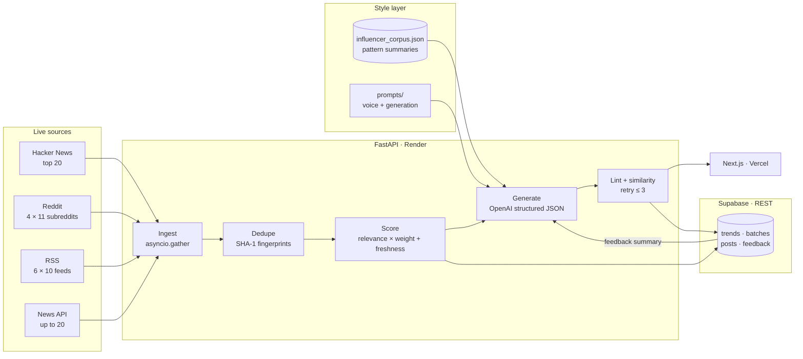

# Netpost — LinkedIn Post Generator

A no-login LinkedIn post generator for B2B fintech and investment banking teams that
**writes only about what the industry actually published today** — and **shows its own
working on every draft.** Each click ingests ~75 live items across four sources, dedupes
and ranks them, then returns five posts with their sources, a lint score and a similarity
verdict attached.

[](https://github.com/Rian-Fernando/LindedIn-Generator/actions/workflows/ci.yml)
[](https://github.com/Rian-Fernando/LindedIn-Generator/actions/workflows/codeql.yml)
[](LICENSE)
[](#why-its-different)
[](https://netpost.rianfernando.com)

**▶ Live: [netpost.rianfernando.com](https://netpost.rianfernando.com)** · [How it works](https://netpost.rianfernando.com/how-it-works) · [llms.txt](https://netpost.rianfernando.com/llms.txt)


## Why it's different

Most AI writing tools start from a blank prompt and produce confident, sourceless copy.
Netpost starts from the feed. It fetches live items from Hacker News, Reddit, industry RSS
and News API on **every** click, fingerprints them to drop near-duplicates, and ranks what
survives by keyword relevance × source weight plus a freshness bonus. Only the top 5–10
items become writing material.

Then it grades itself. Every draft is scored out of 100 by a linter that flags the specific
tells of machine writing — weak hooks, vague claims, filler CTAs, missing credibility,
unreadable paragraph length — and checked by a similarity engine against the style corpus
and your previous posts. Anything scoring 45 or above is regenerated, not shipped. The
score, the flags, the matches and the source links are all visible on the card.

Kept honest: there is **no mock generation path**. If the OpenAI or Supabase configuration
is missing, the backend fails with a real error rather than serving placeholder content
that pretends the system works.

## Architecture



The frontend is a static Next.js App Router build; all live work happens in the FastAPI
backend, which fans out to every source in parallel and persists to Supabase over its REST
API (not the Python SDK, so modern `sb_secret` keys work cleanly).

## What the app does

- **Live trend ingestion** — ~75 items per run from Hacker News, 11 finance/tech
  subreddits, 10 industry RSS feeds and News API, all fetched in parallel. Nothing is
  cached between clicks.
- **Dedupe & scoring** — SHA-1 fingerprints of normalized titles collapse syndicated
  stories; survivors are scored `keyword relevance × source weight + freshness bonus`
  (up to 2.0 for items under 24 hours old) and tagged Fintech / Automation / Banking.
- **Trend brief** — the top 5–10 items, each with a plain-language reason it ranked
  where it did.
- **Five posts per batch** — each mapped to a different trend, with hook, body, format,
  hashtags, tagging hints and source links.
- **Two brand voices** — founder (sharper, opinionated, operator-led) and company
  (measured, educational, category-authoritative).
- **Anti-slop linting** — nine flags scored out of 100: weak hooks, vague claims, generic
  filler, missing credibility, poor readability, hashtag spam, filler CTAs, corporate
  conclusions, excess tagging.
- **Similarity checking** — 35% token overlap + 40% 3-gram shingles + 25% cosine, with
  clear / review / blocked thresholds at 25 and 45.
- **Anti-repetition** — per-batch UUID nonce, fresh angle targets from eight
  banking-specific framings, recent-hook avoidance and trend-ID rotation, so clicking
  twice does not produce the same five posts.
- **Performance feedback loop** — record impressions, reactions, comments, reposts, saves
  and clicks; the summary by hook type, format and voice feeds the next batch.

## The landing page

The home page renders a scroll-driven **three.js** scene of the pipeline itself: four
source clusters stream items down a corridor, converge through a scoring core that dedupes
and ranks, and resolve into five post panels whose stacked bars echo the Netpost mark. The
camera flies a keyframed path as you scroll, with gentle bloom and pointer parallax. It is
lazy-loaded, never server-rendered, drops to a single static frame under
`prefers-reduced-motion`, and hides itself entirely if WebGL is unavailable — the page
content stands on its own without it.

## Data sources

| Feed | Source | Auth | Weight |
|---|---|---|---|
| Top stories | [Hacker News](https://news.ycombinator.com) | none | 1.1 |
| Community | [Reddit](https://www.reddit.com) public JSON | none | 0.95 |
| Industry news | Finextra, PYMNTS, TechCrunch, American Banker, FT Banking, The Banker, Finovate, Tearsheet, Banking Dive, Payments Dive | none | 1.2 |
| Company blogs & changelogs | configurable via `RSS_FEEDS_JSON` | none | 1.3 |
| Headlines | [News API](https://newsapi.org) | `NEWS_API_KEY` | 1.4 |

Company blogs and changelogs are supported through configurable RSS entries with a
`source_type` of `company_blog` or `changelog`, rather than a separate connector. Only
headlines, summaries and links are stored — never full article text. See
[`NOTICE.md`](NOTICE.md) for full attribution.

## Run it

### Backend

```bash
cd backend
cp .env.example .env          # add OPENAI_API_KEY, OPENAI_MODEL, SUPABASE_URL, SUPABASE_KEY
python3 -m pip install -r requirements.txt
uvicorn app.main:app --reload # http://localhost:8000
python -m pytest tests -q     # 7 tests
```

### Frontend

```bash
cd frontend
npm install
cp .env.local.example .env.local   # NEXT_PUBLIC_BACKEND_URL, NEXT_PUBLIC_FEEDEX_KEY
npm run dev                        # http://localhost:3000
npm run lint                       # tsc --noEmit
```

`GET /api/system/status` reports whether AI and database configuration are actually ready —
check it first if generation errors.

## API

| Method | Route | Purpose |
|---|---|---|
| `GET` | `/health` | liveness |
| `GET` | `/api/system/status` | AI + database readiness |
| `GET` | `/api/style-guide` | style bundle, voice guides, pattern summary |
| `GET` | `/api/trends/brief` | ranked trend brief with source breakdown |
| `POST` | `/api/generate-batch` | five posts for `founder` or `company` voice |
| `POST` | `/api/feedback` | record post performance metrics |
| `DELETE` | `/api/trends/cleanup` | prune stored trend events |

## Project structure

```
frontend/
  app/                   App Router pages, llms.txt, robots, sitemap, OG images
  components/            PipelineScene (three.js), Generator, PostCard, OgCard
  lib/site.ts            single source of truth for copy, FAQ and structured data
backend/
  app/api/               route handlers
  app/services/          trends, style, generation, linting, similarity, storage
  app/core/              settings and configuration
  tests/                 linting, similarity, generation parsing, storage
database/                Supabase schema + seeded style-pattern corpus
prompts/                 style guide, founder/company voice, generation prompt
docs/                    architecture notes, research sources, OG asset
```

## Deployment

| Layer | Host | Notes |
|---|---|---|
| Frontend | Vercel | root directory `frontend`, Next.js preset |
| Backend | Render | root directory `backend`, `uvicorn app.main:app` |
| Database | Supabase | private REST, server-to-server only |

Canonical URLs are pinned to the subdomain via `metadataBase`, so any incidental
`*.vercel.app` URL renders the same `<link rel="canonical">` and search engines de-duplicate
to `netpost.rianfernando.com`. Render's `FRONTEND_URL` is set to the same origin so CORS
allows production traffic.

### Discoverability

| Route | What it serves |
|---|---|
| `/llms.txt` | machine-readable summary per the [llms.txt convention](https://llmstxt.org) |
| `/robots.txt` | names the major AI crawlers explicitly; allows `/`, disallows `/api/` |
| `/sitemap.xml` | both indexable pages |
| `/opengraph-image` | 1200×630 PNG per page, generated by `next/og` |

Structured data is split so nothing is declared twice: a sitewide `WebSite` + `Person`
graph in the layout, `WebApplication` + `FAQPage` on the home page, and `TechArticle` on
`/how-it-works`.

### Feedback

In-app feedback is collected with [Feedex](https://feedex.rianfernando.com), loaded from
the root layout with `strategy="lazyOnload"` so it stays off the critical path. The widget
renders only when `NEXT_PUBLIC_FEEDEX_KEY` is set, so a checkout without the variable never
boots it keyless. Theme is pinned to `dark` because the site has no light mode, and the
accent matches the brand teal `#5BC0BE`.

## Notes

- Supabase is required for real persistence and the feedback loop. The local fallback is
  off by default and only enables with an explicit `ALLOW_LOCAL_DEV_FALLBACK=true`.
- The seeded corpus in `database/influencer_corpus.json` stores **pattern summaries only** —
  no copied LinkedIn posts. Research references are cited in
  [`docs/research-sources.md`](docs/research-sources.md).
- Generation requires a real `OPENAI_API_KEY` and `OPENAI_MODEL`. There is no mock path.

## License

[MIT](LICENSE) © Rian Fernando. Independent project — **not affiliated with or endorsed by
LinkedIn Corporation.** Netpost drafts posts and shows its scores; it does not verify
claims. Read the sources before you publish.
